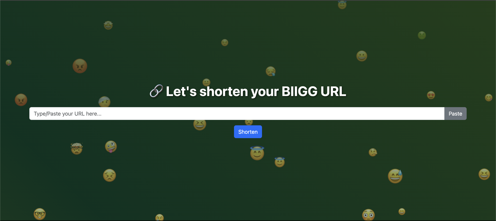
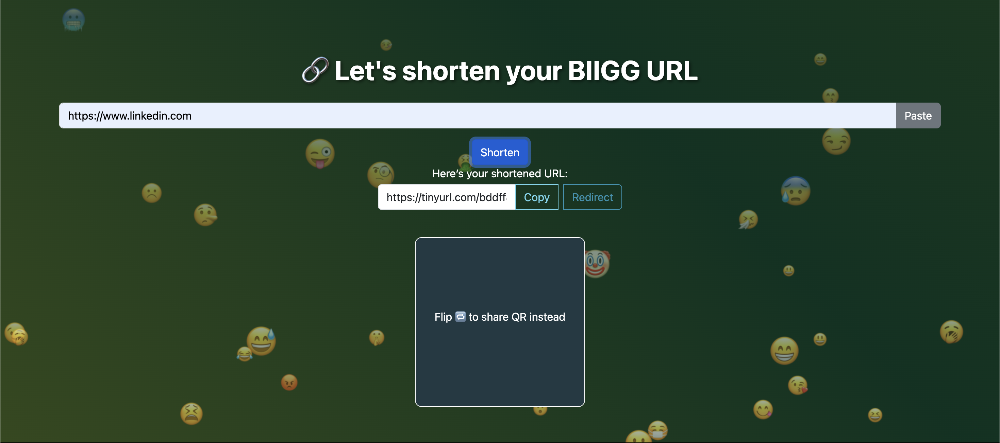

# 🔗 YourShortURL

**YourShortURL** is a sleek, animated, and modern web app that lets users **shorten long URLs**, **copy them**, and **generate beautiful QR codes** for easy sharing. Built with **vanilla HTML/CSS/JavaScript**, it's lightweight, responsive, and easy to extend.

---

## ✨ Features

- ✅ URL shortening using the [TinyURL API](https://tinyurl.com/app/)
- ✅ Copy to clipboard & paste from clipboard
- ✅ QR codes
- ✅ Flip-card animation for QR code reveal
- ✅ Floating icon background & dynamic dark theme
- ✅ Responsive UI built with Bootstrap
- ✅ Animated gradient background

---

## 🌟 Next Features

- 🎯 **Custom URL Alias:** Users can now create a personalized, unique alias for their shortened links.
- 🎨 **Branded QR Codes:** Stylish QR codes with your site’s logo in the center and custom colors for a modern, branded look.
- 📱 **Optimized Footer:** Footer space has been reduced for a cleaner interface and more usable screen area, especially on mobile.

---

## 🚀 Demo

<!--  -->



---

## 🛠️ Tech Stack

- **HTML5 / CSS3 / Bootstrap**
- **Vanilla JavaScript**
- **[TinyURL API](https://tinyurl.com/app/dev)**
- **[qr-code-styling](https://qr-code-styling.com/)**

---

## 📦 Setup Instructions

```bash
git clone https://github.com/niteshk727/yourshorturl.git
cd yourshorturl
# Just open index.html in a browser
